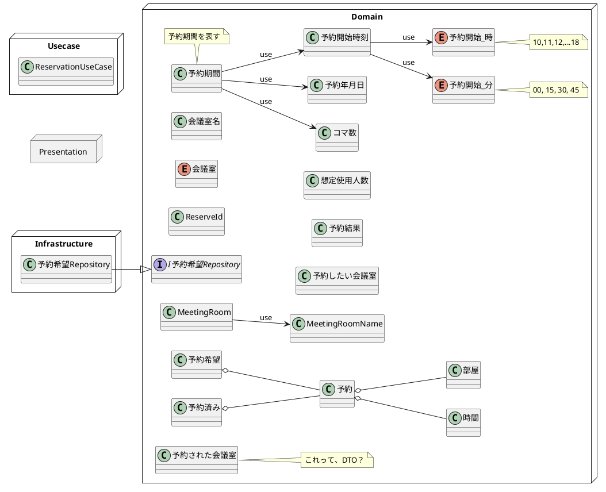

# クラスモデル図

```puml
@startuml
left to right direction

node Domain {
    interface I予約希望Repository
    class MeetingRoom
    class MeetingRoomName

    class 予約期間 
    note bottom : 予約期間を表す

予約希望 o-- 予約
予約済み o-- 予約

予約 o-- 時間
予約 o-- 部屋

    class ReserveId
    enum 会議室
    class 会議室名
    class コマ数
    class 予約された会議室
    note right : これって、DTO？
    class 予約したい会議室
    class 予約希望
    class 予約年月日
    class 予約結果
    enum 予約開始_分
    note right : 00, 15, 30, 45

    enum 予約開始_時
    note right : 10,11,12,...18

    class 予約開始時刻
    class 想定使用人数

    予約期間 --> コマ数 : use
    予約期間 --> 予約年月日 : use
    予約期間 --> 予約開始時刻 : use 

    MeetingRoom --> MeetingRoomName : use
    予約開始時刻 --> 予約開始_分 : use
    予約開始時刻 --> 予約開始_時 : use
}
node Infrastructure {
    class 予約希望Repository
}

予約希望Repository --|> I予約希望Repository 

node Usecase {
    class ReservationUseCase
}

node Presentation {

}

@enduml
```